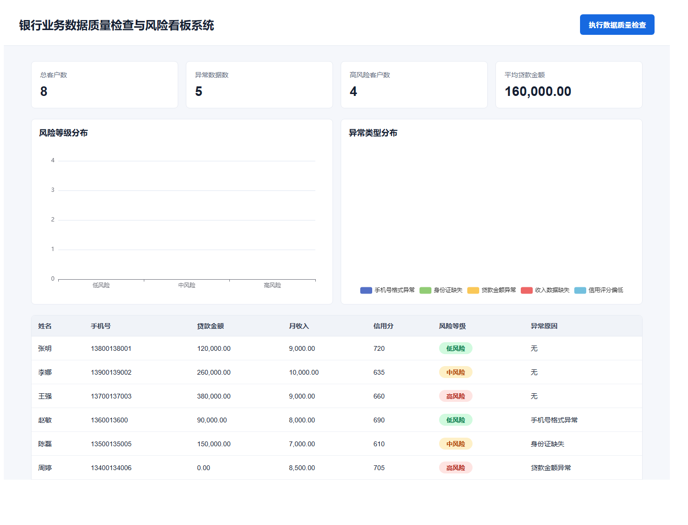

# 银行业务数据质量检查与风险看板系统

## 项目简介

本项目是一个面向银行金融科技 IT 岗位场景的前后端分离项目，模拟银行客户贷款业务数据的质量检查、风险等级识别和可视化看板展示流程。

系统支持客户贷款数据查询、数据质量检查、风险等级划分、异常类型统计和看板展示，重点体现 Spring Boot 后端接口开发、MySQL 数据库设计、React 前端开发、ECharts 可视化展示以及基础系统联调能力。

## 技术栈

- 后端：Spring Boot、Spring Web、Spring Data JPA、Java 17
- 前端：React、Vite、Axios、ECharts
- 数据库：MySQL
- 构建工具：Maven Wrapper、npm
- 开发工具：Git、Postman / 浏览器接口测试

## 功能模块

- 客户贷款数据查询
- 数据质量检查
- 风险等级划分
- 异常类型统计
- 风险等级分布统计
- 数据看板展示
- 前后端接口联调

## 系统截图



> 截图文件请放在 `docs/dashboard.png`。如果暂时没有截图，不影响项目运行。

## 数据质量检查规则

系统会对客户贷款数据执行以下检查：

1. 手机号为空或不是 11 位数字：手机号格式异常
2. 身份证为空：身份证缺失
3. 贷款金额为空或小于等于 0：贷款金额异常
4. 月收入为空或小于等于 0：收入数据缺失
5. 信用分为空或小于 600：信用评分偏低

## 风险等级规则

- 高风险：信用分低于 600，或贷款金额 / 月收入大于 30，或贷款金额、月收入数据无效
- 中风险：信用分在 600 到 649 之间，或贷款金额 / 月收入大于 20
- 低风险：其他正常客户数据

## 数据库设计

核心表：`loan_customer`

主要字段：

| 字段 | 含义 |
|---|---|
| id | 主键 |
| customer_name | 客户姓名 |
| phone | 手机号 |
| id_card | 身份证号 |
| loan_amount | 贷款金额 |
| monthly_income | 月收入 |
| credit_score | 信用分 |
| apply_date | 申请日期 |
| status | 业务状态 |
| risk_level | 风险等级 |
| error_reason | 异常原因 |

## 后端接口

| 方法 | 接口 | 说明 |
|---|---|---|
| GET | `/api/customers` | 查询客户数据 |
| POST | `/api/check` | 执行数据质量检查 |
| GET | `/api/dashboard/summary` | 查询看板汇总数据 |
| GET | `/api/dashboard/error-types` | 查询异常类型分布 |

## 运行方式

### 1. 初始化数据库

先在 MySQL 中执行：

```sql
source backend/sql/init.sql;
```

如果路径执行失败，可以直接复制 `backend/sql/init.sql` 中的 SQL 内容到 MySQL 客户端执行。

### 2. 修改后端数据库配置

打开：

```text
backend/src/main/resources/application.yml
```

修改 MySQL 用户名和密码：

```yaml
spring:
  datasource:
    username: root
    password: your_password
```

也可以在 Windows CMD 中临时设置环境变量：

```bat
set BANK_DB_USERNAME=root
set BANK_DB_PASSWORD=your_password
```

### 3. 启动后端

```bat
cd backend
mvnw.cmd spring-boot:run
```

后端默认运行在：

```text
http://localhost:8080
```

### 4. 启动前端

```bat
cd frontend
npm install
npm run dev
```

前端默认运行在：

```text
http://127.0.0.1:5173
```

## 项目亮点

- 使用 Spring Boot 实现银行业务数据相关接口开发
- 使用 MySQL 设计客户贷款数据表，完成业务数据结构化存储
- 构建数据质量检查规则，识别业务数据中的异常情况
- 基于贷款金额、月收入、信用评分等指标划分风险等级
- 使用 React、Axios、ECharts 实现数据可视化看板
- 完成前后端分离开发、数据库联通和本地部署验证

## 后续优化方向

- 增加用户登录与角色权限控制
- 增加 CSV 批量上传功能
- 增加操作日志和审计追踪
- 引入 Redis 缓存看板统计数据
- 引入 Spring Cloud Gateway 实现统一网关
- 适配 OceanBase 等分布式数据库
